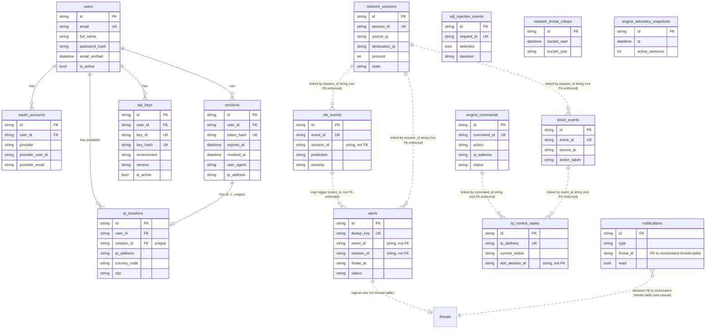

# Database

Data model for SmartIDS, read directly from `backend/app/features/*/models.py` and `backend/migrations/versions/`. For which API routes read/write each table, see `docs/api.md`. For setup/migration commands, see `docs/environment.md`. For why the schema evolved this way, see `docs/decisions.md`.

---

## Engine

PostgreSQL 16 (`backend/docker-compose.yml`), accessed by the backend via async SQLAlchemy (`asyncpg`). Migrations are managed by Alembic (`backend/migrations/`, `backend/alembic.ini`) — 13 migration files currently in `backend/migrations/versions/`.

Every table inherits two mixins (`backend/app/db/base.py`):
- **`CUIDMixin`** — `id: String(64)`, primary key, default = CUID2 (`cuid_wrapper()`).
- **`TimestampMixin`** — `created_at: DateTime(timezone=True)` (server default `now()`), `updated_at: DateTime(timezone=True)` (server default `now()`, `onupdate=now()`).

Naming convention (`Base.metadata.naming_convention`, applied to every constraint/index Alembic generates):
```
ix  -> ix_%(column_0_label)s
uq  -> uq_%(table_name)s_%(column_0_name)s
ck  -> ck_%(table_name)s_%(constraint_name)s
fk  -> fk_%(table_name)s_%(column_0_name)s_%(referred_table_name)s
pk  -> pk_%(table_name)s
```

---

## ER Overview



`||--o{` = real, DB-enforced foreign key. `||..o{` / dotted lines = same-value string correlation used in application queries, with **no FK constraint in the schema** — joining across these requires string equality in code, not a database-enforced relationship.

---

## Tables

### `users` — `app/features/auth/models.py`

| Column | Type | Constraints |
|--------|------|-------------|
| `id` | `String(64)` | PK, default CUID2 |
| `email` | `String(255)` | NOT NULL, unique, indexed |
| `full_name` | `String(255)` | NOT NULL |
| `password_hash` | `String(255)` | nullable (OAuth-only users have none) |
| `email_verified` | `DateTime(timezone=True)` | nullable |
| `is_active` | `Boolean` | NOT NULL, default `true`, server default `"true"` |
| `created_at`, `updated_at` | `DateTime(timezone=True)` | `TimestampMixin` |

**Relationships**: has-many `oauth_accounts`, `sessions`, `api_keys` (all `relationship(..., cascade="all, delete-orphan")` — deleting a user deletes these). Referenced (nullable, `SET NULL`) by `ip_locations.user_id`.

**Usage**: `app/features/auth/{service,repository}.py` (register/login/verify/reset), `app/features/user_sessions/{service,repository}.py` (session listing owner check).

### `oauth_accounts`

| Column | Type | Constraints |
|--------|------|-------------|
| `id` | `String(64)` | PK |
| `user_id` | `String(64)` | FK -> `users.id`, `ON DELETE CASCADE`, NOT NULL, indexed |
| `provider` | `String(50)` | NOT NULL |
| `provider_user_id` | `String(255)` | NOT NULL |
| `provider_email` | `String(255)` | nullable |
| `created_at`, `updated_at` | `DateTime(timezone=True)` | `TimestampMixin` |

**Constraints**: `UniqueConstraint(provider, provider_user_id, name="uq_oauth_accounts_provider_user")`.

**Relationships**: belongs-to `users` (`back_populates="oauth_accounts"`).

**Usage**: `app/features/auth/service.py`, `app/features/auth/repository.py` (GitHub OAuth login/link flow).

### `sessions` — auth session (distinct from `network_sessions`)

| Column | Type | Constraints |
|--------|------|-------------|
| `id` | `String(64)` | PK |
| `user_id` | `String(64)` | FK -> `users.id`, `ON DELETE CASCADE`, NOT NULL, indexed |
| `token_hash` | `String(64)` | NOT NULL, unique, indexed |
| `expires_at` | `DateTime(timezone=True)` | NOT NULL |
| `revoked_at` | `DateTime(timezone=True)` | nullable |
| `user_agent` | `String(512)` | nullable |
| `ip_address` | `String(45)` | nullable |
| `created_at`, `updated_at` | `DateTime(timezone=True)` | `TimestampMixin` |

**Indexes**: migration `20260630_002_add_sessions_user_created_at_index` adds `(user_id, created_at)`.

**Relationships**: belongs-to `users`. Referenced (`CASCADE`, unique) by `ip_locations.session_id`.

**Usage**: `app/features/auth/{service,dependencies}.py` (issue/verify/revoke session cookie), `app/features/user_sessions/{service,repository}.py` (list/revoke sessions), `app/features/geolocation/*` (resolves location per session).

### `api_keys`

| Column | Type | Constraints |
|--------|------|-------------|
| `id` | `String(64)` | PK |
| `user_id` | `String(64)` | FK -> `users.id`, `ON DELETE CASCADE`, NOT NULL, indexed |
| `name` | `String(255)` | NOT NULL |
| `description` | `Text` | nullable |
| `key_id` | `String(64)` | NOT NULL, unique, indexed (public-safe identifier) |
| `environment` | `Enum(APIKeyEnvironment: live/test/development)` | NOT NULL, indexed |
| `version` | `String(8)` | NOT NULL, indexed, default `"v1"` |
| `key_hash` | `Text` | NOT NULL, unique, indexed (one-way, never reversible) |
| `is_active` | `Boolean` | NOT NULL, server default `"true"` |
| `expires_at` | `DateTime(timezone=True)` | nullable |
| `created_at`, `updated_at` | `DateTime(timezone=True)` | `TimestampMixin` |

**Indexes**: `ix_api_keys_user_id_name (user_id, name)`, `ix_api_keys_user_env (user_id, environment)`.

**Relationships**: belongs-to `users` (`back_populates="api_keys"`).

**Usage**: `app/features/api_keys/{service,repository}.py` — CRUD behind `/api-keys*` (`docs/api.md`). Not currently checked as an auth mechanism by any other route.

### `ip_locations` — `app/features/geolocation/models.py`

| Column | Type | Constraints |
|--------|------|-------------|
| `id` | `String(64)` | PK |
| `user_id` | `String(64)` | FK -> `users.id`, `ON DELETE SET NULL`, nullable, indexed |
| `session_id` | `String(64)` | FK -> `sessions.id`, `ON DELETE CASCADE`, NOT NULL, **unique** (one location row per auth session), indexed |
| `ip_address` | `String(45)` | NOT NULL, indexed |
| `country` | `String(100)` | nullable |
| `country_code` | `String(10)` | nullable, indexed |
| `state` | `String(100)` | nullable |
| `state_code` | `String(20)` | nullable |
| `city` | `String(100)` | nullable |
| `postal_code` | `String(20)` | nullable |
| `latitude`, `longitude` | `Float` | nullable |
| `timezone` | `String(64)` | nullable |
| `provider` | `String(64)` | NOT NULL |
| `resolved_at` | `DateTime(timezone=True)` | NOT NULL |
| `created_at`, `updated_at` | `DateTime(timezone=True)` | `TimestampMixin` |

**Indexes**: `ix_ip_locations_user_id_resolved_at (user_id, resolved_at)`, `ix_ip_locations_country_code_city (country_code, city)`.

**Relationships**: `relationship(foreign_keys=[user_id])` to `users`, `relationship(foreign_keys=[session_id])` to `sessions`. Has a custom `__repr__`.

**Usage**: `app/features/geolocation/{service,repository}.py` (resolve via `GEOLOCATION_PROVIDER=freeipapi`), `app/features/user_sessions/{service,repository}.py` (populates `UserSessionResponse.location`).

### `network_sessions` — `app/features/sessions/models.py`

| Column | Type | Constraints |
|--------|------|-------------|
| `id` | `String(64)` | PK |
| `session_id` | `String(128)` | NOT NULL, unique, indexed |
| `start_time` | `DateTime(timezone=True)` | NOT NULL, indexed |
| `end_time` | `DateTime(timezone=True)` | nullable, indexed |
| `last_seen_at` | `DateTime(timezone=True)` | nullable, indexed (added in `20260617_001`) |
| `source_ip` | `String(45)` | NOT NULL, indexed |
| `destination_ip` | `String(45)` | NOT NULL, indexed |
| `source_port` | `Integer` | nullable |
| `destination_port` | `Integer` | nullable, indexed |
| `protocol` | `Integer` | NOT NULL, indexed (numeric: TCP=6, UDP=17, ICMP=1, UNKNOWN=0) |
| `packet_count` | `Integer` | NOT NULL, default 0 |
| `byte_count` | `Integer` | NOT NULL, default 0 |
| `duration` | `Float` | NOT NULL, default 0.0 |
| `risk_score` | `Float` | NOT NULL, default 0.0, indexed |
| `ml_prediction` | `String(128)` | nullable, indexed |
| `heuristic_result` | `String(128)` | nullable |
| `state` | `String(32)` | NOT NULL, default `"active"`, indexed |
| `created_at`, `updated_at` | `DateTime(timezone=True)` | `TimestampMixin` |

**Indexes**: `ix_network_sessions_source_dest (source_ip, destination_ip)`, `ix_network_sessions_state_start (state, start_time)`, `ix_network_sessions_state_last_seen (state, last_seen_at)`.

**Relationships**: none FK-enforced. Correlated by matching string `session_id` to `ids_events.session_id`, `alerts.session_id`, `block_events.session_id`, and `ip_control_states.last_session_id` — application-level joins only.

**Usage**: `app/features/sessions/{service,repository}.py` (`/sessions*`), `app/features/traffic/router.py` (`/traffic`, thin wrapper, same table), `app/features/dashboard/{service,repository}.py` (summary/rollup metrics), `app/features/ids_events/service.py` (cross-referenced when ingesting events).

### `ids_events` — `app/features/ids_events/models.py`

| Column | Type | Constraints |
|--------|------|-------------|
| `id` | `String(64)` | PK |
| `event_id` | `String(128)` | NOT NULL, unique, indexed |
| `schema_version` | `String(16)` | NOT NULL |
| `ts` | `DateTime(timezone=True)` | NOT NULL, indexed |
| `source` | `String(64)` | NOT NULL, indexed |
| `model` | `String(128)` | NOT NULL |
| `prediction` | `String(128)` | NOT NULL, indexed |
| `confidence` | `Float` | NOT NULL |
| `severity` | `String(32)` | NOT NULL, indexed |
| `action` | `String(64)` | NOT NULL, indexed |
| `protocol` | `Integer` | nullable, indexed |
| `source_ip` | `String(45)` | nullable, indexed (added `20260617_001`) |
| `destination_ip` | `String(45)` | nullable, indexed (added `20260617_001`) |
| `source_port` | `Integer` | nullable (added `20260617_001`) |
| `destination_port` | `Integer` | nullable (added `20260617_001`) |
| `attack_type` | `String(128)` | nullable, indexed (added `20260617_001`) |
| `session_id` | `String(128)` | nullable, indexed (added `20260617_001`) |
| `features` | `JSON` | NOT NULL, default `{}` |
| `created_at`, `updated_at` | `DateTime(timezone=True)` | `TimestampMixin` |

**Indexes**: `ix_ids_events_ts_severity (ts, severity)`, `ix_ids_events_prediction_action (prediction, action)`, `ix_ids_events_source_dest (source_ip, destination_ip)`.

**Relationships**: none FK-enforced; `event_id` is referenced by `alerts.event_id` as a plain string.

**Usage**: `app/features/ids_events/{service,repository}.py` (`POST/GET /ids-events`), `app/features/logs/router.py` (`GET /logs`, thin wrapper, same table), `app/features/analytics_rollups/service.py` (rollup aggregation source).

### `alerts` — `app/features/alerts/models.py`

| Column | Type | Constraints |
|--------|------|-------------|
| `id` | `String(64)` | PK |
| `dedup_key` | `String(128)` | NOT NULL, unique, indexed |
| `event_id` | `String(128)` | NOT NULL, indexed |
| `prediction` | `String(128)` | NOT NULL, indexed |
| `severity` | `String(32)` | NOT NULL, indexed |
| `confidence` | `Float` | NOT NULL |
| `action` | `String(64)` | NOT NULL, indexed |
| `source` | `String(64)` | NOT NULL, indexed |
| `status` | `String(32)` | NOT NULL, default `"open"`, indexed |
| `first_seen_at`, `last_seen_at` | `DateTime(timezone=True)` | NOT NULL |
| `occurrence_count` | `Integer` | NOT NULL, default 1 |
| `threat_id` | `String(128)` | nullable, indexed (added `20260529_006`) |
| `detection_method` | `String(32)` | nullable (added `20260529_006`) |
| `action_taken` | `String(64)` | nullable (added `20260529_006`) |
| `session_id` | `String(128)` | nullable, indexed (added `20260529_006`) |
| `source_ip`, `destination_ip` | `String(45)` | nullable, indexed (added `20260529_006`) |
| `source_port`, `destination_port` | `Integer` | nullable (added `20260529_006`) |
| `protocol` | `Integer` | nullable (added `20260529_006`) |
| `risk_score` | `Float` | nullable (added `20260529_006`) |
| `is_final` | `Boolean` | NOT NULL, default `False`, server default `false` (added `20260529_006`) |
| `created_at`, `updated_at` | `DateTime(timezone=True)` | `TimestampMixin` |

**Indexes**: `ix_alerts_source_severity (source, severity)`, `ix_alerts_status_last_seen (status, last_seen_at)`.

**Relationships**: none FK-enforced. **This table is queried directly by the "threats" feature** — `ThreatRepository.get_by_threat_id()` does `select(Alert).where(or_(Alert.threat_id == threat_id, Alert.id == threat_id))`. There is no separate `threats` table anywhere in the migrations.

**Usage**: `app/features/alerts/{service,repository}.py` (`/alerts*`), `app/features/threats/repository.py` (`/threats*`, same table), `app/features/dashboard/{service,repository}.py` (incidents, attack distribution, top IPs/ports), `app/features/realtime/service.py` (broadcasts derived from alert state), `app/features/ids_events/service.py` (creates/updates alerts on ingest, `alert_triggered` flag).

### `sql_injection_events` — `app/features/sql_injection/models.py`

| Column | Type | Constraints |
|--------|------|-------------|
| `id` | `String(64)` | PK |
| `request_id` | `String(128)` | NOT NULL, unique, indexed |
| `ts` | `DateTime(timezone=True)` | NOT NULL, indexed |
| `source` | `String(64)` | NOT NULL, indexed |
| `query_preview` | `String(255)` | NOT NULL (truncated copy of the inbound query, not the full query) |
| `detected` | `Boolean` | NOT NULL, indexed |
| `confidence` | `Float` | NOT NULL |
| `reason` | `String(255)` | nullable |
| `decision` | `String(16)` | NOT NULL, indexed (`"allow"`/`"block"`) |
| `http_status` | `Integer` | NOT NULL, indexed |
| `created_at`, `updated_at` | `DateTime(timezone=True)` | `TimestampMixin` |

**Indexes**: `ix_sql_injection_events_detected_ts (detected, ts)`.

**Relationships**: none.

**Usage**: `app/features/sql_injection/{service,repository}.py` (`POST /sql-injection/decide`) — audit-only, see `docs/architecture.md`.

### `engine_commands` — `app/features/engine_commands/models.py`

| Column | Type | Constraints |
|--------|------|-------------|
| `id` | `String(64)` | PK |
| `command_id` | `String(128)` | NOT NULL, unique, indexed |
| `action` | `String(32)` | NOT NULL, indexed (`block`/`unblock`/`watchlist`/`unwatchlist`) |
| `ip_address` | `String(45)` | NOT NULL, indexed |
| `duration_seconds` | `Integer` | NOT NULL |
| `status` | `String(32)` | NOT NULL, default `"queued"`, indexed |
| `ack_status` | `String(64)` | nullable (added `20260529_005`) |
| `ack_source` | `String(64)` | nullable (added `20260529_005`) |
| `delivered_at` | `DateTime(timezone=True)` | nullable, indexed |
| `acked_at` | `DateTime(timezone=True)` | nullable, indexed |
| `created_at`, `updated_at` | `DateTime(timezone=True)` | `TimestampMixin` |

**Indexes**: `ix_engine_commands_status_created (status, created_at)`.

**Relationships**: none FK-enforced; `command_id` referenced as a plain string by `ip_control_states.last_command_id`.

**Usage**: `app/features/engine_commands/{service,repository}.py` (`POST/GET /engine-commands`, `POST /engine-commands/ack`), `app/features/blocked_ips/service.py` (enqueues commands from manual block/unblock/watchlist actions — see `docs/api.md`).

### `block_events` — `app/features/block_events/models.py`

| Column | Type | Constraints |
|--------|------|-------------|
| `id` | `String(64)` | PK |
| `event_id` | `String(128)` | NOT NULL, unique, indexed |
| `ts` | `DateTime(timezone=True)` | NOT NULL, indexed |
| `source_ip` | `String(45)` | NOT NULL, indexed |
| `action_taken` | `String(32)` | NOT NULL, indexed |
| `reason` | `String(128)` | NOT NULL |
| `detection_method` | `String(32)` | NOT NULL, indexed |
| `session_id` | `String(128)` | nullable, indexed |
| `source_port` | `Integer` | nullable |
| `destination_ip` | `String(45)` | nullable, indexed |
| `destination_port` | `Integer` | nullable |
| `protocol` | `Integer` | nullable, indexed |
| `created_at`, `updated_at` | `DateTime(timezone=True)` | `TimestampMixin` |

**Indexes**: `ix_block_events_source_action (source_ip, action_taken)`.

**Relationships**: none FK-enforced; `event_id` referenced as a plain string by `ip_control_states.last_block_event_id`.

**Usage**: `app/features/block_events/{service,repository}.py` (`POST /block-events/upsert`), `app/features/ip_control_state/service.py` (updates IP control state on block/unblock), `app/features/blocked_ips/repository.py` (activity history, `GET /blocked-ips/{ip}/activity`), `app/features/analytics_rollups/service.py` and `app/features/dashboard/{service,repository}.py` (`block-actions-over-time`, audit history).

### `ip_control_states` — `app/features/ip_control_state/models.py`

| Column | Type | Constraints |
|--------|------|-------------|
| `id` | `String(64)` | PK |
| `ip_address` | `String(45)` | NOT NULL, unique, indexed |
| `current_status` | `String(32)` | NOT NULL, indexed |
| `control_source` | `String(32)` | NOT NULL, indexed |
| `reason` | `String(128)` | nullable |
| `first_blocked_at` | `DateTime(timezone=True)` | nullable |
| `last_changed_at` | `DateTime(timezone=True)` | NOT NULL, indexed |
| `expires_at` | `DateTime(timezone=True)` | nullable |
| `last_command_id` | `String(128)` | nullable |
| `last_block_event_id` | `String(128)` | nullable |
| `last_session_id` | `String(128)` | nullable, indexed |
| `created_at`, `updated_at` | `DateTime(timezone=True)` | `TimestampMixin` |

**Indexes**: `ix_ip_control_states_status_changed (current_status, last_changed_at)`.

**Relationships**: none FK-enforced — one row per IP, kept in sync from `engine_commands`/`block_events` by string ID references (`last_command_id`, `last_block_event_id`, `last_session_id`).

**Usage**: `app/features/ip_control_state/{service,repository}.py`, consumed by `app/features/block_events/service.py` when recording a block/unblock action. Introduced in `20260630_003`; not yet exposed by a dedicated router (no `ip_control_state/router.py` — see `docs/api.md`, `blocked_ips` router covers the user-facing surface instead).

### `network_threat_rollups` — `app/features/analytics_rollups/models.py`

| Column | Type | Constraints |
|--------|------|-------------|
| `id` | `String(64)` | PK |
| `bucket_start` | `DateTime(timezone=True)` | NOT NULL, indexed |
| `bucket_size` | `String(16)` | NOT NULL, default `"hour"`, indexed |
| `network_activity_total` | `Integer` | NOT NULL, default 0 |
| `threat_event_total` | `Integer` | NOT NULL, default 0 |
| `benign_event_total` | `Integer` | NOT NULL, default 0 |
| `blocked_event_total` | `Integer` | NOT NULL, default 0 |
| `telemetry_snapshot_count` | `Integer` | NOT NULL, default 0 |
| `ml_prediction_total` | `Integer` | NOT NULL, default 0 |
| `active_sessions_peak` | `Integer` | NOT NULL, default 0 |
| `packet_loss_event_total` | `Integer` | NOT NULL, default 0 |
| `threat_rate` | `Float` | NOT NULL, default 0.0 |
| `created_at`, `updated_at` | `DateTime(timezone=True)` | `TimestampMixin` |

**Constraints**: `UniqueConstraint(bucket_start, bucket_size, name="uq_network_threat_rollups_bucket")`.

**Indexes**: `ix_network_threat_rollups_bucket_rate (bucket_start, threat_rate)`.

**Relationships**: none — pre-aggregated from `ids_events`/`alerts`/`block_events`/`engine_telemetry_snapshots` by `analytics_rollups` service logic.

**Usage**: `app/features/analytics_rollups/{service,repository}.py`, `app/features/dashboard/{service,repository}.py` (`GET /dashboard/network-threat-rollups`). Introduced in `20260630_003`; no dedicated public router beyond the dashboard read endpoint.

### `engine_telemetry_snapshots` — `app/features/engine_telemetry/models.py`

| Column | Type | Constraints |
|--------|------|-------------|
| `id` | `String(64)` | PK |
| `ts` | `DateTime(timezone=True)` | NOT NULL, indexed |
| `packets_received_total`, `packets_received_per_30s`, `packets_processed_total`, `packets_dropped_total`, `packets_lost_total` | `Integer` | NOT NULL |
| `packet_loss_detected` | `Boolean` | NOT NULL, default `False` |
| `packet_queue_size`, `packet_queue_maxsize` | `Integer` | NOT NULL |
| `packet_queue_usage_percent` | `Float` | NOT NULL |
| `active_sessions` | `Integer` | NOT NULL, indexed (composite) |
| `ml_predictions_total`, `ml_predictions_per_30s` | `Integer` | NOT NULL |
| `ml_processing_rate_per_30s` | `Float` | NOT NULL |
| `last_ml_prediction_latency_ms` | `Float` | NOT NULL, default 0.0 |
| `application_attribution_available` | `Boolean` | NOT NULL, default `False` |
| `application_attribution_note` | `String(512)` | NOT NULL |
| `active_network_exchanges` | `JSON` (list of dicts) | NOT NULL, default `[]` |
| `created_at`, `updated_at` | `DateTime(timezone=True)` | `TimestampMixin` |

**Indexes**: `ix_engine_telemetry_snapshots_ts_queue (ts, packet_queue_usage_percent)`, `ix_engine_telemetry_snapshots_ts_active_sessions (ts, active_sessions)`. Table created whole in `20260617_001_live_dashboard_query_models`.

**Relationships**: none.

**Usage**: `app/features/engine_telemetry/{service,repository}.py` (`POST /engine-telemetry`, `GET /health/runtime*`), `app/features/dashboard/{service,repository}.py` (`GET /dashboard/history`, model-metrics inputs).

### `notifications` — `app/features/notifications/models.py`

| Column | Type | Constraints |
|--------|------|-------------|
| `id` | `String(64)` | PK |
| `type` | `Enum(NotificationType: threat/system/alert/info)` | NOT NULL, indexed |
| `title` | `String(255)` | NOT NULL |
| `message` | `Text` | NOT NULL |
| `read` | `Boolean` | NOT NULL, server default `false`, indexed |
| `threat_id` | `String(128)` | FK -> `threats.id`, `ON DELETE SET NULL`, nullable |
| `severity` | `String(32)` | nullable |
| `created_at`, `updated_at` | `DateTime(timezone=True)` | `TimestampMixin` |

**Indexes**: `notifications_read_idx (read)`, `notifications_created_at_idx (created_at)`.

**Schema inconsistency (do not assume this FK resolves)**: `threat_id` declares `ForeignKey("threats.id")`, but **no `threats` table exists in any migration** — "threats" is served from the `alerts` table by application code (see `alerts` above), not a real table. This FK target does not point at anything that exists; whether it silently fails to enforce, errors at migration/constraint-creation time, or was never actually applied to the live schema is not determinable from the model file alone — verify against the live database's `information_schema` before relying on it.

**Usage**: `app/features/notifications/{service,repository}.py` (`POST /notifications/read-all`, `POST /notifications/{id}/read`).

---

## Migrations

| Revision | Adds |
|----------|------|
| `20260525_001_create_auth_tables` | `users`, `oauth_accounts`, `sessions` |
| `20260529_001_create_ids_events_table` | `ids_events` |
| `20260529_002_create_alerts_and_sql_injection_events_tables` | `alerts`, `sql_injection_events` |
| `20260529_003_create_network_sessions_table` | `network_sessions` |
| `20260529_004_create_engine_commands_table` | `engine_commands` |
| `20260529_005_add_ack_source_to_engine_commands` | `engine_commands.ack_source` |
| `20260529_006_unify_reporting_contract` | adds `threat_id, detection_method, action_taken, session_id, source_ip, destination_ip, source_port, destination_port, protocol, risk_score, is_final` to `alerts`; creates `block_events` |
| `20260617_001_live_dashboard_query_models` | adds `source_ip, destination_ip, source_port, destination_port, attack_type, session_id` to `ids_events`; adds `last_seen_at` to `network_sessions`; creates `engine_telemetry_snapshots` |
| `2a839dcadf78_create_api_keys_table` | `api_keys` (note: bare-hash filename, not timestamp-prefixed like the others — see `docs/coding-standards.md`) |
| `20260630_001_create_ip_locations_table` | `ip_locations` |
| `20260630_002_add_sessions_user_created_at_index` | index on `sessions(user_id, created_at)` |
| `20260630_003_add_ip_control_state_and_network_threat_rollups` | `ip_control_states`, `network_threat_rollups` |

No migration creates a `threats` table, `notifications` table's own migration was not individually inspected line-by-line here beyond the model above, or a `database.backend` shared barrel (referenced only in `backend/CHECKLIST.md` as a since-removed transitional artifact, per `docs/decisions.md`).

---

## Frontend Schema (Separate, Partially Drifted)

`frontend/src/lib/db/schema.ts` (Drizzle ORM) defines its own schema against the same Postgres database for some frontend read paths: `users`, `apiKeys`, `threats`, `notifications`, `analyticsSnapshots`, plus enums `severity`, `threatStatus`, `notificationType`.

The frontend's `threats` and `analyticsSnapshots` tables have **no corresponding Alembic migration** in `backend/migrations/` — they are not part of the backend-owned schema documented above. Per `backend/CHECKLIST.md` ("Confirm the frontend remains read-only and does not write directly to the database"), the backend's Alembic migrations are the authoritative schema; treat the frontend Drizzle schema as legacy/partially stale rather than a second source of truth. Do not assume `frontend/src/lib/db/schema.ts` reflects the tables above — verify against `backend/migrations/versions/` first.

## Seed / Backup

- Seed: `bun run db:seed` (frontend, `frontend/src/lib/db/seed.ts`, Drizzle) — seeds the frontend-visible schema only. No backend-side seed command found.
- Backup/restore: Unknown — no scripts found in the repository.
